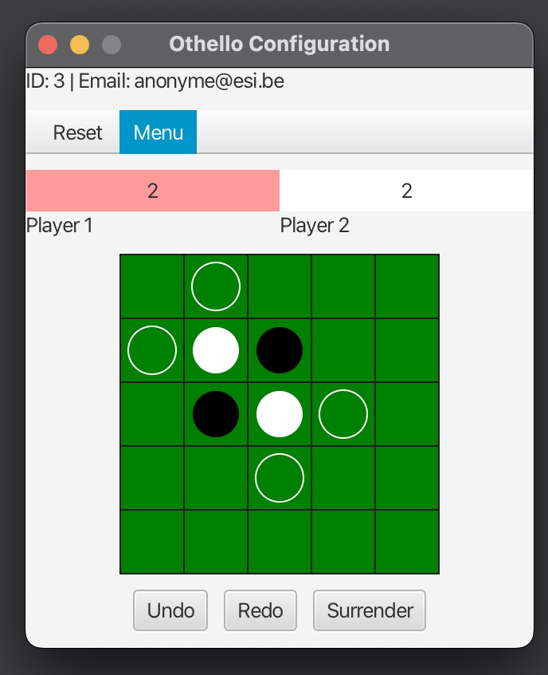

# Othello – Java Client/Server with Frontend & Backend


## Overview
A complete **client–server Othello (Reversi)** implementation in **Java 17**, with a **JavaFX** frontend (FXML) and **SQLite** persistence.  
It demonstrates real-time synchronization, a custom message protocol, **Undo/Redo/Surrender/Reset**, CPU opponents (Dumb / PseudoSmart), and a modular Maven multi-module setup.  
The project was developed as part of an academic assignment, highlighting **software design patterns** and **clean architecture**.

---

## Architecture (MVC-Inspired, Client–Server)
This repository is **Client–Server** with a **shared Common** module. It follows **MVC principles** but is **not a strict end-to-end MVC**:
- **Server**: clear **Model + Controller** separation (no View). The server is the **single source of truth**: clients only send requests, and only the server modifies the game state.
- **Client**: JavaFX **View (FXML)** + **Controllers**, with a lightweight client model (`OthelloClient`) for networking/state.
- **Common**: DTOs/messages that define the contract between client and server. Both client and server depend on `Common`, but **not on each other**.

**Modules**
- **`OthelloCommonAlec` (Common)** — Protocol & DTOs:  
  - `message.*`: `MessageInit`, `MessagePlay`, `MessageUndo`, `MessageRedo`, `MessageQuit`, `MessageReset`, `MessageGameInfo`, `MessageProfile`, `Type`.  
  - `common.*`: `User`, `Members`, `GameInfo`, `PositionDTO`, `Config`.
- **`OthelloServerAlec` (Backend)** — Game engine and persistence:  
  - Model: `Board`, `Game`, `Position`, `State`, `GameState`.  
  - Controller: `Controller`, `OthelloCompute`, `Strategy`, `DumbStrategy`, `PseudoSmartStrategy`.  
  - Persistence: `DBManager`, `UserDAO`, `GameDAO`, `ScoreDAO`, `ResetDAO`, `StateMapper`.  
  - Networking: `AbstractServer`, `Server`, `ConnectionToClient`.  
  - Entry point: `ServerConsole`.
- **`OthelloClientAlec` (Frontend)** — JavaFX-based application:  
  - View: `LoginView.fxml`, `BoardPane`, `MainPane`, `ScorePane`, `ButtonPane`.  
  - Controllers: `LoginController`, `ClientJavaFx`, `ClientConsole`.  
  - Model: `OthelloClient` (extends `AbstractClient`).  
  - Entry point: `MainApp`.

---

## Design Patterns
- **Strategy** — AI behaviors (`DumbStrategy`, `PseudoSmartStrategy`).  
- **Command** — Unified interface for actions (`execute`, `undo`, `redo`).  
- **Memento-like Snapshots** — Undo/redo via history stacks in `Game`.  
- **Observer** — JavaFX and client update views on state change.  
- **DAO** — Encapsulation of database logic (`UserDAO`, `GameDAO`, etc.).  
- **DTO / Mapper** — `GameInfo`, `Config`, `PositionDTO` exchanged over network; `StateMapper` ensures decoupling between server model and DTOs.

---

## Undo / Redo
- **Server-side**: `Game` keeps two stacks: `undoHistory` and `redoHistory`.  
- **Undo**: pops from `undoHistory`, restores board, pushes to `redoHistory`.  
- **Redo**: pops from `redoHistory`, reapplies board, pushes to `undoHistory`.  
- **Client-side**: JavaFX `ButtonPane` → buttons trigger `MessageUndo`/`MessageRedo` via controller.  
- This guarantees deterministic state synchronization.

---

## Protocol (Messages)
The client–server communication is handled through a custom protocol:
- `PROFILE` — identifies user on connection.  
- `PLAY` — send a move.  
- `UNDO` — request undo.  
- `REDO` — request redo.  
- `QUIT` — leave the game.  
- `GAMEINFO` — full game state sync.  
- `INIT` — start a new game.  
- `RESET` — clear history.  

---

## Persistence (SQLite via JDBC)
The server uses an embedded **SQLite** database (`resources/sqliteDB/othello.db`) with schema in `othello.sql`:
- Tables: `SEQUENCE`, `USER`, `GAME`, `SCORE`.  
- `UserDAO.findOrCreate(email)` ensures every client is uniquely registered.  
- Games and scores are persisted for history tracking.  

---

## Profile Management
- Each player is represented by a `User` object (email + ID).  
- On login, client sends `MessageProfile`; server responds with ACK.  
- Limitations: no password, no avatars, only email/ID shown.  

---

## Debugging & Testing
- **ClientConsole** and **ServerConsole** log all messages exchanged.  
- This design makes debugging straightforward: every interaction can be traced.  

---

## Known Bugs & Limitations
- No automatic **reconnection** after client crash/disconnect.  
- Limited input validation (email format, port numbers).  
- UI buttons remain active after `ENDGAME`.  
- No integrated **scoreboard** in UI (data only in DB).  

---

## Future Improvements
- Add **PASS** message for when a player has no legal moves.  
- Implement **automatic reconnection** & better network error handling.  
- Improve **UI feedback** (disable buttons at correct times, in-game scoreboard).  
- Add **unit & integration tests** (currently only manual testing).  
- Extend AI with **Minimax** or more advanced heuristics.  

---

## Screenshots
  
*Login screen (JavaFX).*  

  
*Game setup (board size, mode).*

  
*AI selection (Dumb / Smart).*  

  
*Board with Undo/Redo/Surrender.*  

  
*GameOver Screen.*

---

## Setup

### Requirements
- JDK 17+  
- Maven 3.8+  
- SQLite driver (auto-included via `sqlite-jdbc`).  

### Build
```bash
cd OthelloCommonAlec && mvn install -DskipTests
cd ../OthelloServerAlec && mvn package -DskipTests
cd ../OthelloClientAlec && mvn package -DskipTests
```

### Run Server
```bash
cd OthelloServerAlec
mvn exec:java -Dexec.mainClass="main.ServerConsole"
```

### Run Client
```bash
cd OthelloClientAlec
mvn javafx:run -Dexec.mainClass=main.MainApp
```

---

## Features
- Real-time Othello gameplay with network sync.  
- Undo / Redo, Surrender, Reset.  
- CPU opponents with different strategies.  
- SQLite persistence for users, games, scores.  
- Modular, extensible architecture.  

---

## Author
**Alec Waumans (2025)**

---

## License
Licensed under the **MIT License** — see [LICENSE](LICENSE).
